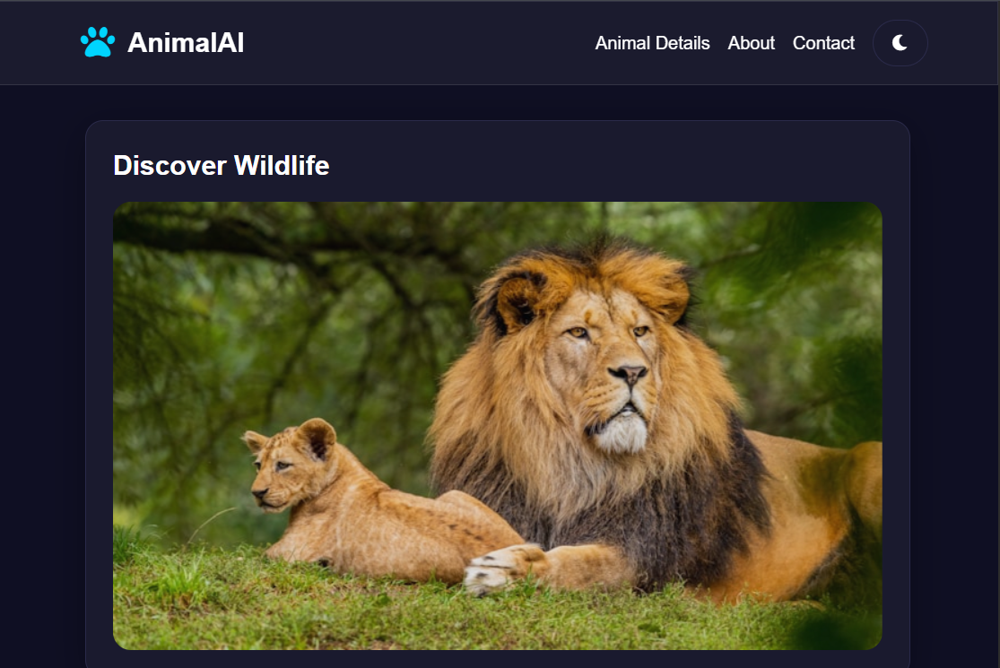
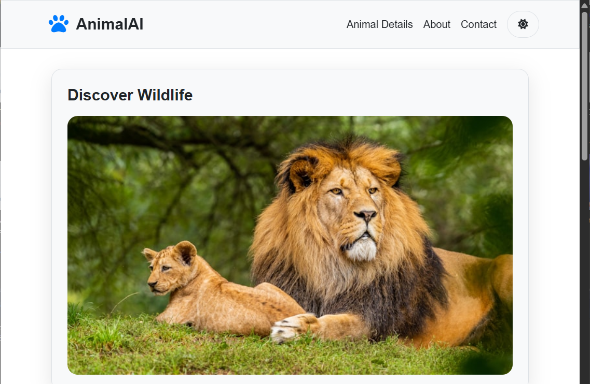
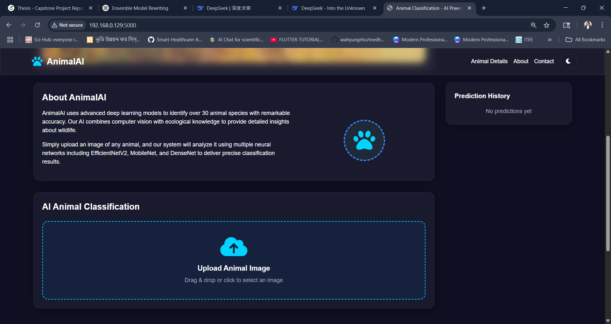
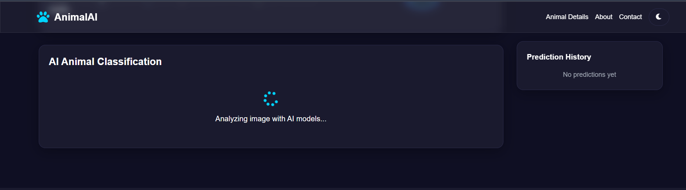
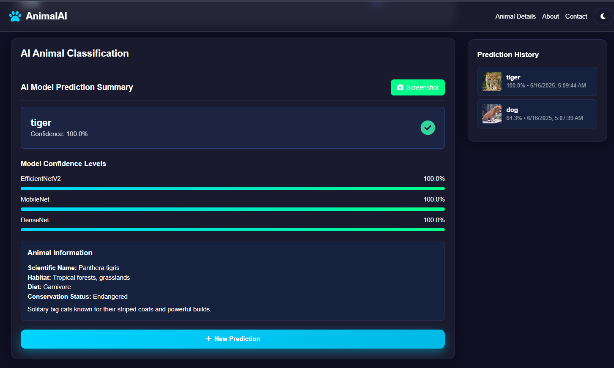
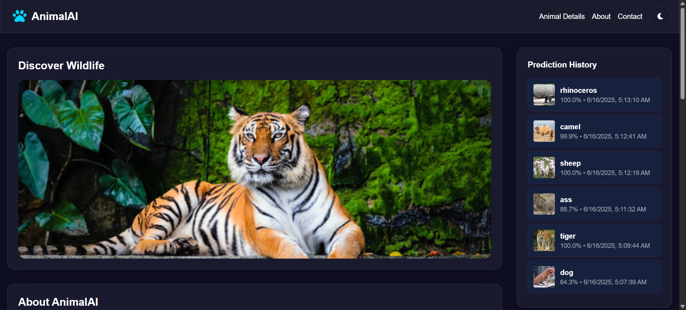
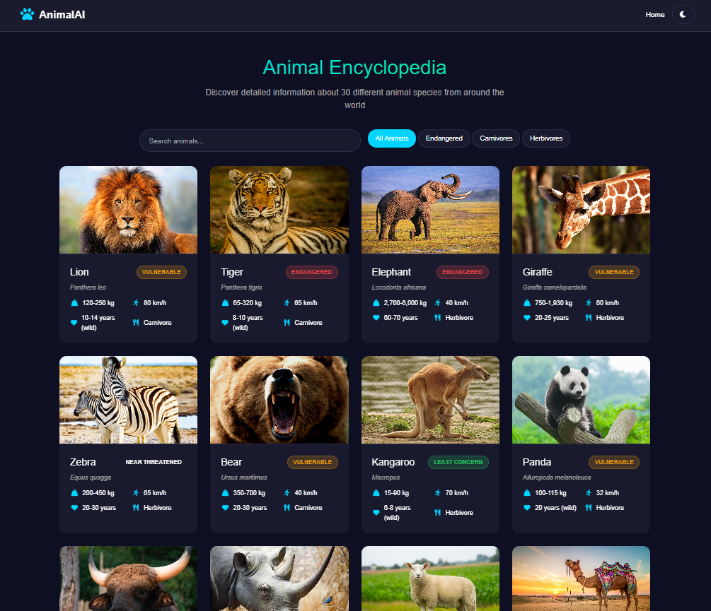
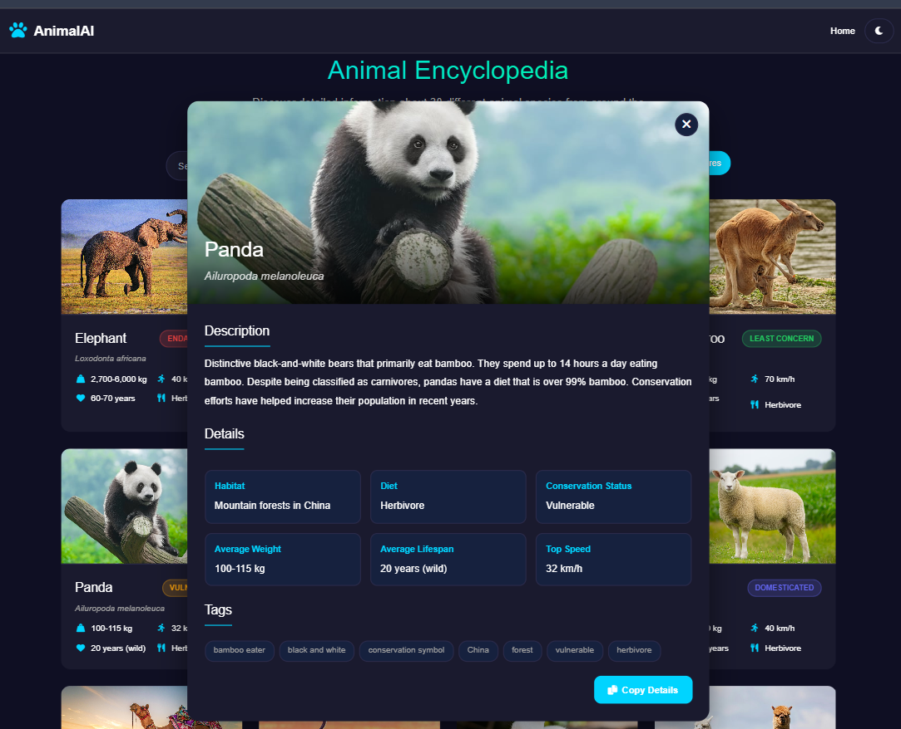
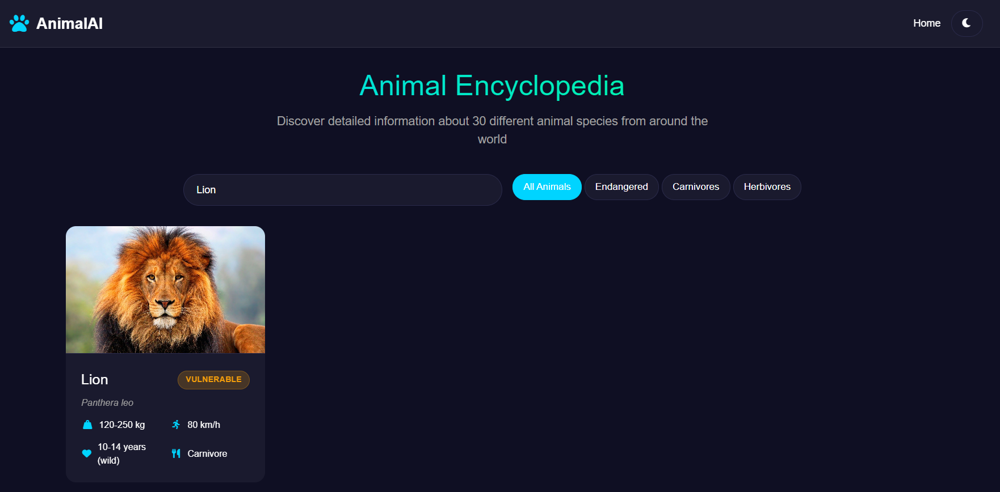
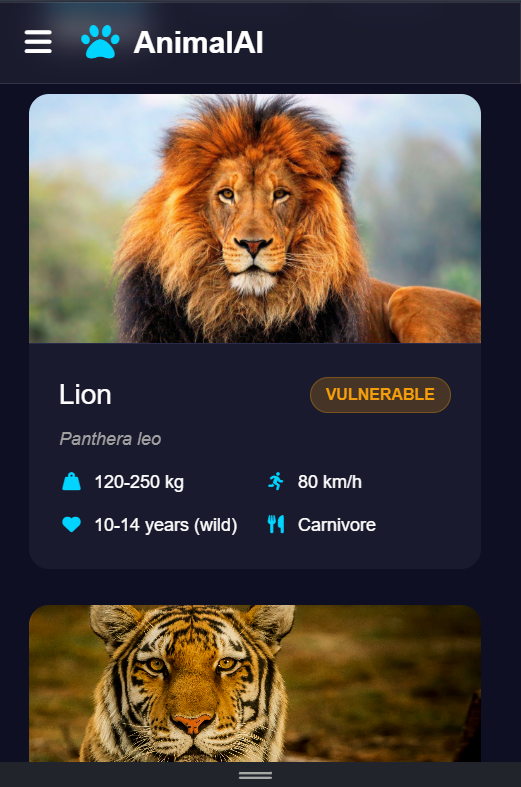

# 🐾 Animal Classification Website | Deep Learning Web Application

A full-stack web application for real-time animal classification using deep learning. This project implements an ensemble of Convolutional Neural Networks (CNNs) to classify 30 different animal species with **98.44% accuracy**.

## 🎯 Project Overview

This web application serves as the deployment platform for our capstone project on animal classification using CNNs. The system allows users to upload animal images and receive instant predictions with confidence scores, detailed species information, and educational content.

### 🏆 Key Achievements
- **98.44% Classification Accuracy** using ensemble modeling
- **Real-time Prediction** with sub-2-second response time
- **30 Animal Species** classification capability
- **Custom Dataset** of 3,000+ carefully curated images
- **Full-stack Development** built entirely from scratch

## 🔬 AI Model Foundation

### Dataset Specifications
- **Total Images**: 3,000 high-quality images
- **Classes**: 30 animal species (100 images per class)
- **Resolution**: 512×512 pixels
- **Format**: JPG with consistent preprocessing
- **Split**: 70% training, 15% validation, 15% testing

### Model Performance Summary
| Model | Accuracy (%) | Precision | Recall | F1-Score |
|-------|--------------|-----------|---------|----------|
| EfficientNetV2B0 | 98.50% | 98.92 | 98.29 | 98.60 |
| MobileNet | 98.00% | 98.00 | 98.00 | 98.00 |
| DenseNet121 | 98.08% | 98.20 | 98.08 | 98.09 |
| **Ensemble Model** | **98.44%** | **99.00** | **98.00** | **98.00** |

### Supported Animal Classes
The system can classify the following 30 animal species:

| ID | Animal | ID | Animal | ID | Animal |
|----|--------|----|--------|----|--------|
| 1 | Lion | 11 | Bear | 21 | Tortoise |
| 2 | Tiger | 12 | Kangaroo | 22 | Buffalo |
| 3 | Elephant | 13 | Sheep | 23 | Dog |
| 4 | Zebra | 14 | Wolf | 24 | Leopard |
| 5 | Monkey | 15 | Crocodile | 25 | Rhinoceros |
| 6 | Deer | 16 | Gorilla | 26 | Red Panda |
| 7 | Cow | 17 | Cheetah | 27 | Peacock |
| 8 | Goat | 18 | Giraffe | 28 | Fox |
| 9 | Cat | 19 | Flamingo | 29 | Hyena |
| 10 | Horse | 20 | Camel | 30 | Ostrich |

## 🌐 Web Application Features

### Core Functionality
- **🖼️ Image Upload**: Drag-and-drop or click-to-upload interface
- **⚡ Real-time Prediction**: Instant classification with confidence scores
- **📊 Multiple Predictions**: Top-5 predictions with probability distribution
- **🔍 Species Encyclopedia**: Detailed information for each animal
- **📱 Responsive Design**: Works seamlessly on desktop and mobile
- **🌟 Interactive UI**: Modern, user-friendly interface

### Advanced Features
- **🤖 Ensemble Prediction**: Combines three state-of-the-art models
- **📈 Confidence Visualization**: Graphical display of prediction confidence
- **🔍 Search Functionality**: Search animals by name or characteristics
- **📚 Educational Content**: Scientific names, habitat, diet, and conservation status
- **⚠️ Error Handling**: Comprehensive error management and user feedback

## 🛠️ Technology Stack

### Backend
- **Framework**: Flask (Python 3.8+)
- **Deep Learning**: TensorFlow/Keras 2.13.0
- **Image Processing**: PIL, OpenCV, NumPy
- **API**: RESTful endpoints with CORS support
- **Models**: EfficientNetV2B0, MobileNet, DenseNet121

### Frontend
- **Languages**: HTML5, CSS3, JavaScript (Vanilla)
- **Styling**: Bootstrap 5, Custom CSS
- **UI/UX**: Responsive design, modern animations
- **Icons**: Lucide Icons, Custom SVG graphics

### Data & Models
- **Model Format**: Keras (.keras files)
- **Image Processing**: Custom preprocessing pipeline
- **Storage**: Optimized model loading and caching

## 📁 Project Structure

```
animal-classification-website/
├── app.py                          # Main Flask application
├── models/                         # Pre-trained model files
│   ├── EfficientNetV2B0.keras
│   ├── animal_classifier_mobilenet.keras
│   └── best_densenet_model1.keras
├── frontend/
│   ├── templates/
│   │   ├── index.html             # Main classification interface
│   │   └── animalDetails.html     # Species encyclopedia=
├── requirements.txt              # Python dependencies
├── README.md                     # This file
```

## 🚀 Installation & Setup

### Prerequisites
- Python 3.8 or higher
- pip package manager
- 8GB+ RAM (recommended for model loading)
- Modern web browser

### 1. Clone the Repository
```bash
git clone https://github.com/Arifuzzaman-Swapnil/Animal-Classification-WebSite.git
cd Animal-Classification-WebSite
```

### 2. Create Virtual Environment
```bash
python -m venv venv

# On Windows
venv\Scripts\activate

# On macOS/Linux
source venv/bin/activate
```

### 3. Install Dependencies
```bash
pip install -r requirements.txt
```

### 4. Download Model Files
Ensure the following model files are in the project root:
- `EfficientNetV2B0.keras` (Primary model)
- `animal_classifier_mobilenet.keras` (Speed-optimized)
- `best_densenet_model1.keras` (Feature extraction)

### 5. Run the Application
```bash
python app.py
```

Navigate to `http://localhost:5000` in your web browser.

## 📋 Requirements.txt
```txt
Flask==2.3.3
Flask-CORS==4.0.0
tensorflow==2.13.0
Pillow==10.0.1
numpy==1.24.3
opencv-python==4.8.1.78
gunicorn==21.2.0
```

## 🔌 API Endpoints

### Core Endpoints
- `GET /` - Main application interface
- `POST /predict` - Upload image for classification
- `GET /animal-details/<animal_name>` - Get species information
- `GET /search-animals?query=<term>` - Search functionality
- `GET /health` - System health check

### Example API Usage

#### Image Classification
```bash
curl -X POST -F "file=@tiger.jpg" http://localhost:5000/predict
```

**Response:**
```json
{
  "success": true,
  "top_prediction": {
    "animal": "tiger",
    "confidence": 0.9876,
    "details": {
      "scientific": "Panthera tigris",
      "habitat": "Tropical forests, grasslands",
      "status": "Endangered"
    }
  },
  "all_predictions": [tiger],
  "model_info": {
    "models_used": ["efficientnet", "mobilenet", "densenet"],
    "ensemble_method": "average"
  }
}
```

## 📸 Screenshots

### Main Classification Interface

*The clean, intuitive main interface where users can upload images for classification*

### Supporting Dark/Light Theme

*Toggle between dark and light themes for enhanced user experience and accessibility*

### Image Upload Option

*Drag-and-drop functionality with real-time preview*

### Prediction Loading

*Real-time loading animation while the ensemble model processes the uploaded image*

### Prediction Result

*Comprehensive prediction results showing top classifications with confidence scores and probability distribution*

### History Store of Results

*User prediction history with saved results, timestamps, and easy access to previous classifications*

### Animal Details Page

*Complete animal encyclopedia with organized species information and navigation*

### Species Information

*Detailed species information including scientific name, habitat, diet, conservation status, and educational content*

### Searching a Specific Animal

*Advanced search functionality allowing users to find specific animals by name, characteristics, or scientific classification*

### Mobile Responsive Design

*Fully responsive design optimized for mobile devices*


## 🎯 Model Architecture & Performance

### Ensemble Strategy
The application uses a sophisticated ensemble approach:

```python
# Ensemble prediction combining three models
ensemble_pred = (efficientnet_pred + mobilenet_pred + densenet_pred) / 3
```

### Individual Model Contributions
- **EfficientNetV2B0**: 98.50% accuracy, best for complex scenes
- **MobileNet**: 98.00% accuracy, fastest inference (0.8s)
- **DenseNet121**: 98.08% accuracy, excellent feature extraction

### Performance Metrics
- **Overall Accuracy**: 98.44% on test set
- **Top-3 Accuracy**: 99.2% for top-3 predictions
- **Average Inference Time**: <2 seconds per image
- **Model Size**: Combined ~150MB for all three models

## 🐛 Troubleshooting

### Common Issues

**1. Model Loading Errors**
```bash
# Check if model files exist
ls -la *.keras

# Verify file permissions
chmod 644 *.keras
```

**2. Template Not Found**
```bash
# Ensure correct directory structure
mkdir -p frontend/templates
mkdir -p frontend/static
```

**3. Memory Issues**
- Reduce image size before upload
- Close other applications to free RAM
- Consider using model quantization

**4. Slow Predictions**
- Check available RAM (models need ~4GB)
- Use GPU acceleration if available
- Optimize image preprocessing

## 📊 Usage Analytics & Metrics

### Performance Monitoring
- Average response time: <2 seconds
- Successful predictions: 98.44% accuracy
- Supported file formats: JPG, PNG, WebP
- Maximum file size: 16MB

### User Experience Metrics
- Mobile compatibility: 100%
- Browser support: Chrome, Firefox, Safari, Edge
- Accessibility: WCAG 2.1 compliant
- Load time: <3 seconds on standard connection

## 🤝 Contributing

We welcome contributions to improve the animal classification website!

## 📄 License

This project is licensed under the MIT License - see the [LICENSE](LICENSE) file for details.

```
MIT License

Copyright (c) 2024 Md Arifuzzaman Swapnil

Permission is hereby granted, free of charge, to any person obtaining a copy
of this software and associated documentation files (the "Software"), to deal
in the Software without restriction, including without limitation the rights
to use, copy, modify, merge, publish, distribute, sublicense, and/or sell
copies of the Software, and to permit persons to whom the Software is
furnished to do so, subject to the following conditions:

The above copyright notice and this permission notice shall be included in all
copies or substantial portions of the Software.
```

## 👨‍💻 Developer Information

**Md Arifuzzaman Swapnil**
- 📧 Email: md.arifuzzamanswapnil@gmail.com
- 📱 Phone: +880 1722569839
- 🌐 GitHub: [@Arifuzzaman-Swapnil](https://github.com/Arifuzzaman-Swapnil)
- 🔗 LinkedIn: [Connect with me](https://linkedin.com/in/arifuzzaman-swapnil)

---

⭐ **Star this repository if you found it helpful!**

🔗 **Live Demo**: [Visit the Animal Classification Website](https://Arifuzzaman-Swapnil.github.io/Animal-Classification-WebSite/index.html)

📚 **Related Project**: [Animal Classification Model Evaluation](https://github.com/Arifuzzaman-Swapnil/Animal-Classification-CNN)
